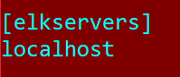

# Install Elk stack with ansible
## Uses ansible playbook and roles
These instructions were first grabbed from here: https://logz.io/blog/elk-stack-ansible/

However, they were documeneted in 2019, and things have changed.

I recommend still forking [Daniel Berman's repo](https://github.com/DanielBerman/ansible-elk-playbook.git) as it is a good start if you're unfamiliar with ansible roles and playbooks

## Environment setup

Given that this installation is based on ansible playbooks, you have the ability to install it from anywhere that ansible is installed, and TO anywhere that you can ssh into with a <strong>ssh key pair established<strong>.

- I recommend using a server/client model for this installation. This means two machines (virtual or physical) with one machine having ansible installed and the other will have the ELK stack installed by ansible over ssh. I had my ansible download the ELK stack onto the same machine (meaning localhost to ansible), but this requires some extra configuration I will not cover here, however it isn't too hard and can be googled.
- Ensure an SSH key-pair is establishing. Verify this by attemtping to SSH to the client machine from the server machine, if you are prompted for a password, your key-pair is <strong>NOT<strong> setup correctly!
- Download ansible for your server's operating system (Windows is not recommended as it requires extra steps and may cause problems down the road), this can be easily googled.
- Add your client machine to your server's /etc/hosts file
- Add your client machine to your server's /etc/ansible/hosts using the same hostname as the step above, under a group tag named "elkservers" like so:

 

- Clone the git repository mentioned at the top of this file (YOUR forked version). NOTE: This repo cannot be cloned without first being forked from Daniel Berman's github.

## Modifications to existing files
### Change target java repository
- The ppa that the java ansible role attempts to download no longer has a verified release so the APT package manager will by default refuse to download it. Replace the contents of the ansible-elk-playbook/roles/java/tasks/main.yml with this:

``` 
- name: Install Java 8
  apt:
    name: openjdk-8-jdk
    state: present
    update_cache: yes 
```

- Modify the <strong>site.yml<strong> file located at the root of the repository. Open it in whatever text editor you have available.
- Change the "remote_user" to the user on your client machine (If using an ubuntu based EC2 instance as your client, leave this as ubuntu)

## Execute ansible playbook
- Let's first make sure ansible can reach our targets by executing the follow command.
```
ansible elkservers -m ping
```
- If the above command returned "UNREACHABLE", but you can succesfully SSH from your server to client with no password prompt, it is likely a typo in your /etc/hosts or /etc/ansible/hosts file. The latter is looking at your /etc/hosts file so make sure they are written the same.
- If that succeeded then let's run our playbook with the following command from the repositories root directory:
```
sudo ansible-playbook site.yml
```
- You should see ansible go through each role and download the respective packages.
- Start the Kibana service with:
```
sudo service kibana start
```
- The kibana dashboard is available by default at <clientIP>:5601